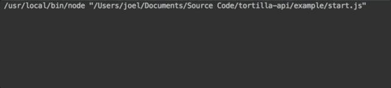
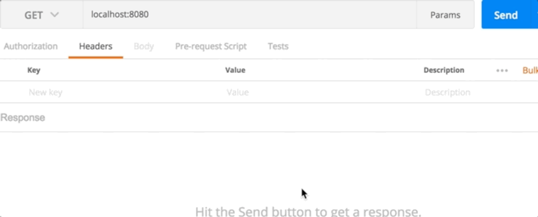
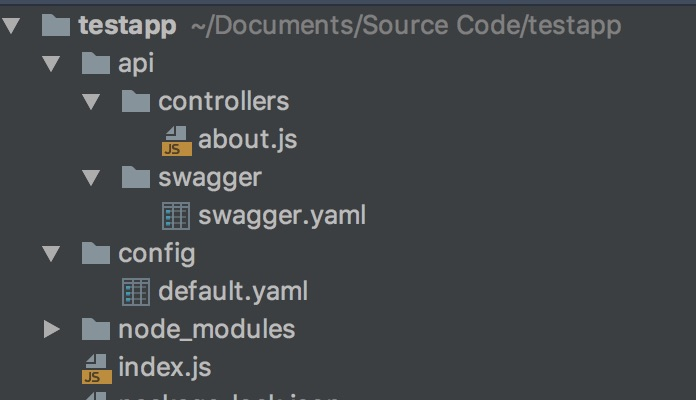
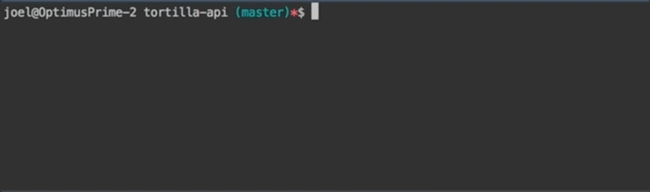
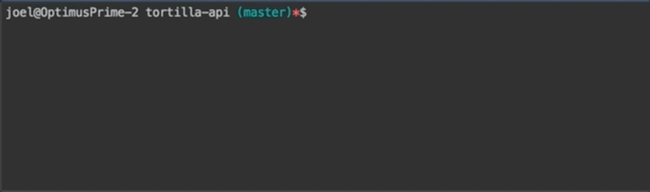
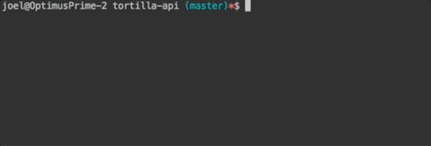

# Tortilla-API

[](https://codeclimate.com/github/jobando89/tortilla-api) []() [](https://www.npmjs.com/package/tortilla-api) [](https://codeclimate.com/github/jobando89/tortilla-api/maintainability) [](https://travis-ci.org/jobando89/tortilla-api) [](https://coveralls.io/github/jobando89/tortilla-api?branch=master)


Tortilla-API is wrapper of restify and swaggerRestify for a quick and easy creation of REST API in node.

### Getting Started

Install dependencies:
```
$ npm install tortilla-api
```

### Demo

Clone the repo

```
$ git clone https://github.com/jobando89/tortilla-api.git
```

Inside the repo folder

```
$ npm install

$ npm start
```


Generate a get request to ***http://localhost:8080***



#### Prerequisites

Tortilla-API the a file structure relative to where appRoot is setup.

##### Folder Structure

The ***api*** folder should contain a ***controllers*** and a ***swagger*** folder. The ***controllers*** folder contains the files for the swagger defined in ***x-swagger-router-controller*** for each swagger path. The ***swagger*** folder contains the ***swagger.yaml*** definition. The location of the application folders is defined in the appRoot prorperty inside the ***tortilla.create()*** method.



#### Configuration

##### Configuration Documentation

```javascript
tortilla.create(
	{
        definition: { // App definition
            appRoot, //Start point of where to look for application folders
            port, //The port to use to listen for requests. The default port is 8080  
            logger //Controller logger
        },
        events: { //Events and restify middleware
            onServerStart, //Called before the server starts
    
            afterStart, //Called after the server has started
    
            onTerminate, //Called before the application is terminated
    
            error, //Event handler when there is an unhandled exception in the application
    
            middleware: [ //Referrer to Universal handlers for usage of middleware (http://restify.com/docs/home/)
            //Array of functions
            ]
        },
        wrapper: { //Properties and error handling for controller methods
            props: (req, res) => { //Add to the wrapper when used in the controller methods
            },
            errorHandler:(statusCode, message,reply)=>{ //Unhandled exceptions from the controller methods can be taken care of here.
            //By default all errors will return http 500 with the error message of the exception
            }
        },
        serverLogger //Set logging method
    }
);
```
##### Configuration Example

```javascript
const tortilla = require('tortilla-api');

tortilla.create(
    {
        definition: { // App definition
            appRoot: __dirname,
            port: 8080
        },
        events: { //Events and restify middleware
            onServerStart: function(context) {
                console.log('Called before the server starts')
            },
            afterStart: function(context) {
                console.log('Called after the server has started')
            },
            onTerminate: function(context) {
                console.log('Called before the application is terminated')
            },
            error: function(err) {
                console.log('unhandled exception in the application')
            },
            middleware: [
                function(req, res, next) {
                    console.warn('run for all routes!');
                    return next();
                }
            ]
        },
        wrapper: { //Properties and error handling for controller methods
            props: function (req, res) {
                const myQueryParam = req.getParam('myQueryParam');
                return {
                    myQueryParam
                };
            },
            errorHandler:(statusCode, message,reply)=>{
                if (message.includes('doesn\'t exist')) {
                    return reply.notFound(message);
                }
            }
        },
        serverLogger: { 
            // Adding logging at the server level. Any logging logging library 
            // should work what implements the below are the 
            // possible logging levels
            debug: console.log,
            log: console.log,
            info: console.log,
            warn: console.log,
            error: console.log
        }
    }
);
```
##### Controller Documentation

The controller uses the api method implementation of restify.

**For more information on restify properties see [http://restify.com/docs/server-api/](http://restify.com/docs/server-api/).**
```javascript
    ControllerExample : Wrapper.wrap(async helper => {//Initialize controller method
        //Helper native properties
        helper.res // response property
        helper.req//  request property
        helper.reply // setup replay for request needed to end http request 
        helper.logger // Log at different levels: debug, log, info, warn and error
        return helper.res.reply.ok('Hello World');
    })
```

##### Controller Method Example

```javascript
const tortilla = require('tortilla-api');
const Wrapper = tortilla.wrapper;

module.exports={
    ControllerExample : Wrapper.wrap(async helper => {
        helper.logger.info('Hello World');
        return helper.reply.ok('Hello World');
    })
};
```


### Tests

##### Unit Tests

```
$ npm run test
```


##### Code Coverage

```
$ npm run cover
```



##### Coding Style Tests

```
$ npm run lint
```




### License
[MIT License](LICENSE.md)